# Implementing Wordpress Website w/ Logical Volume Management (LVM) Storage Mangement
### Purpose
    Acquire knowlege and skills to succesfully implement and manage a WordPress Website on AWS EC2 using LVM storage management . Leveraging the power of AWS cloud infrastructure to build scalable abnd reliable WordPress sites
### Goal
    1. Configure storage subsystem for WEB and Database servers based on LinuxOS. 

    2. Install Wordpress and connect it to a remote MySQL database server  

### Steps to Implementing LVM on Linux Servers (both the Webserver and Database Server)
    1. Prepare both the Webserver and Database server and creating 3 volumes each of 10 GiB and attaching them to their respective EC2 Instance. 3 10 GiB volumes for the webserver EC2 instance & 3 10 GiB volumes for the Database EC2 instance
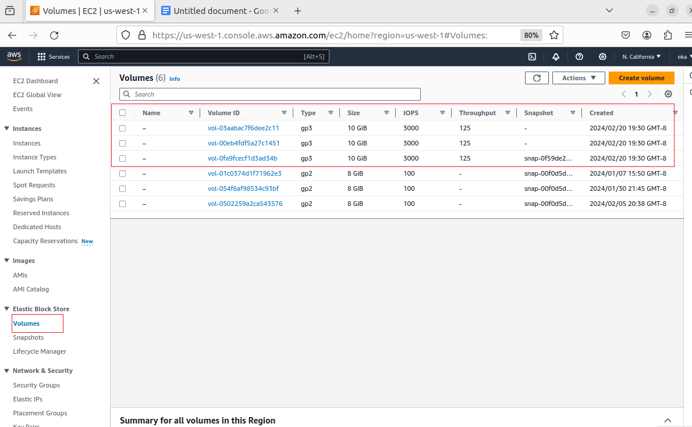
    As you can see in the linux terminal the comman lsblk allows me to inspect what bloack devices are attached to the server

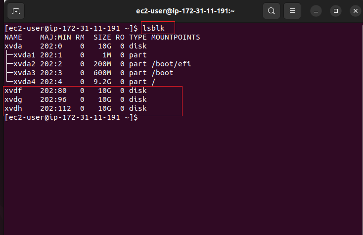

    To confirm I can inspect it with 'ls /dev/' and made sure that I can see all 3 newly created block devices *red rectangle*

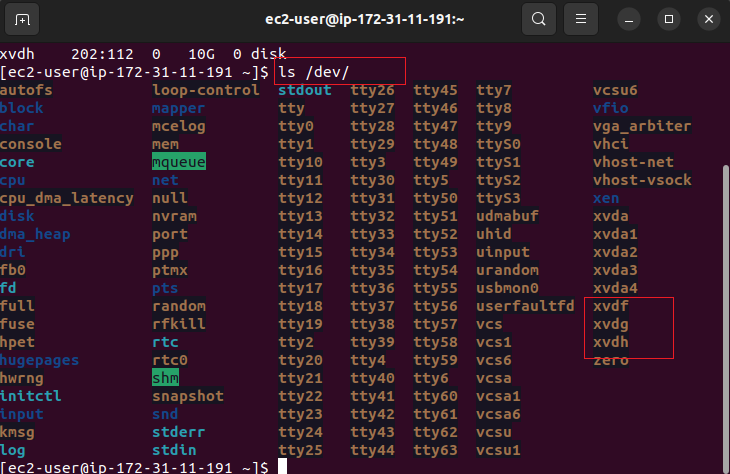

    2.) I am going to create single partition on each of the 3 disks using the command 'sudo gdisk' /dev/xvdf , /dev/xvdg /dev/xvdh

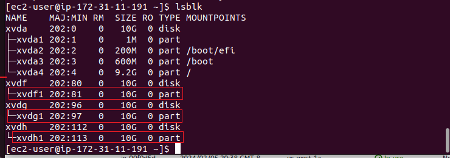

    3.) I installed lvm2 package using the syntax : sudo yum install lvm2 and ran sudo lvmdiskscan command to check the available partitions

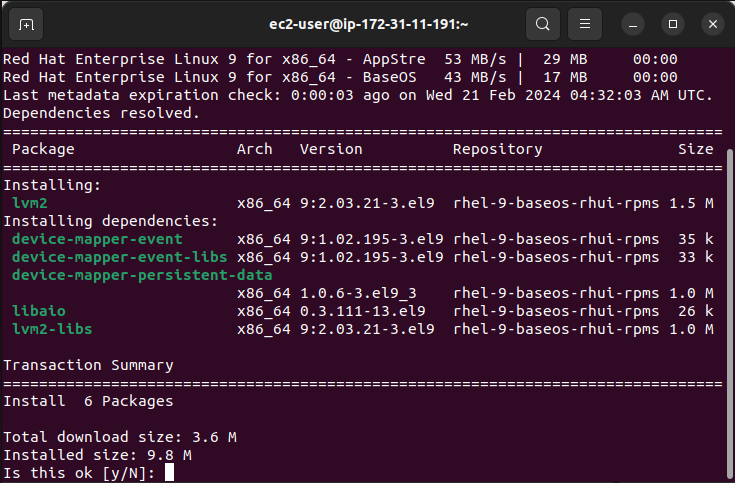

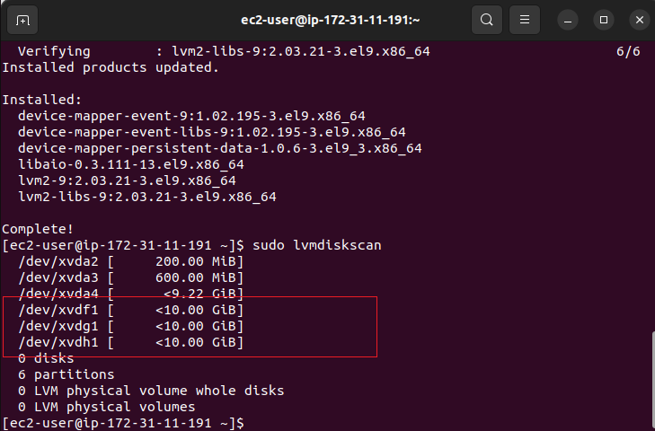

    4.) Using 'pvcreate' utilty to mark the 3 disks as physical volumes (PVs) to be used by LVM. Also added all 3 PVs to a volume group called webdata-vg 

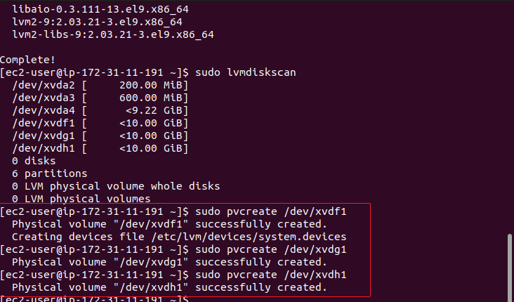

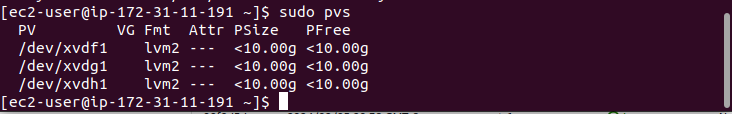

     5.) Subsequently, crated 2 logical volumes for the purposed of 'apps-lv'to be used to stor data for the website while 'logs-lv' will be used to store data for logs. For the database server 'db-lv' logical volume was created instead of 'app-lv' as db-lv will be used to srot data for the database. The logical volumes both have half of the PV size (30 g)

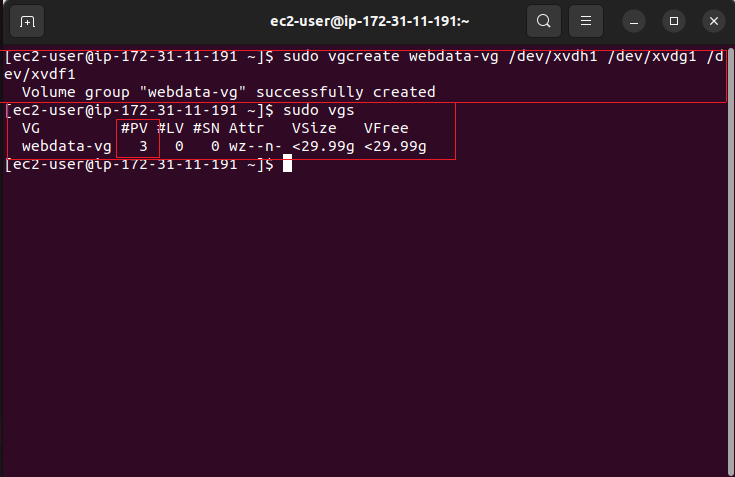
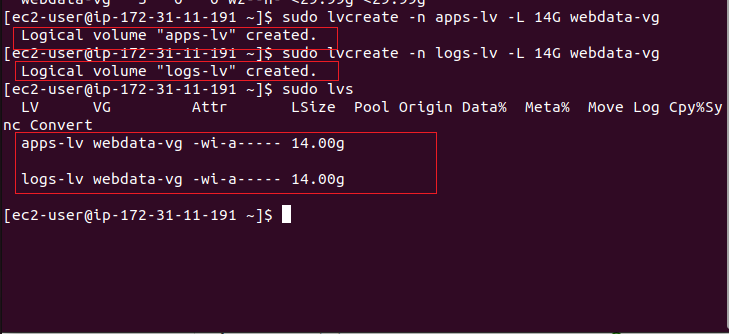

    6.) Verify my entire setup

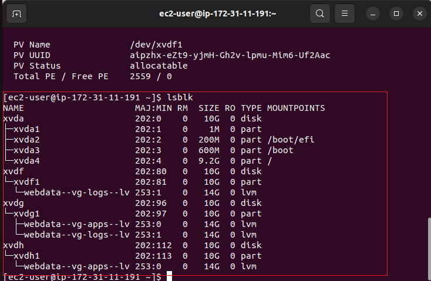

     7.) Next formated the logical volumes with ex4 filesystem using 'mfs.ext4'
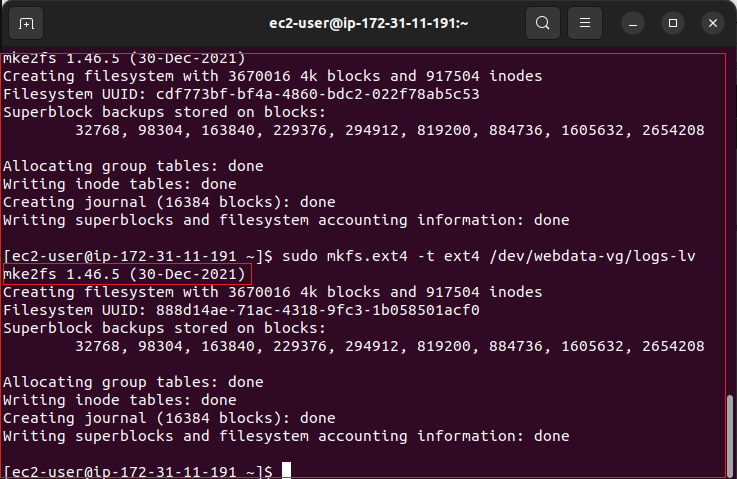

    8.) To store my website files, I created a /var/www/html/ directory and a /home/recovery/logs to stor backup of log data.

    Subsequently, mounted /dev/webdata-vg/(we created earlier above) to var/www/html/

    For the log files, before mounting the file systems, we use the utility rsync to backup all the files in the log directory /var/log into /home/recovery /logs. After thos the we mount as done above and we restor the log files back into /var/log directory

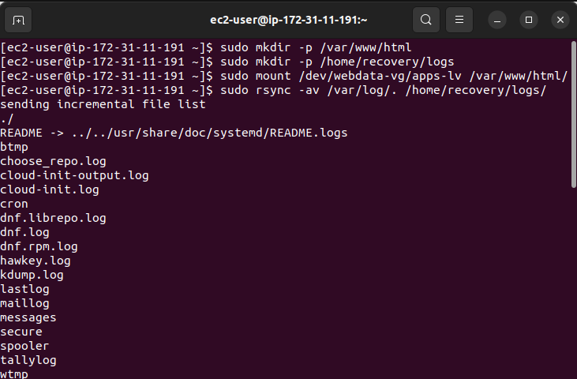

    9.) updated the /etc/fstab so that the mount configuration will persist after the restart of the server

    10.) After testing and reloading the configuration, Verifying the setup by running df -h 

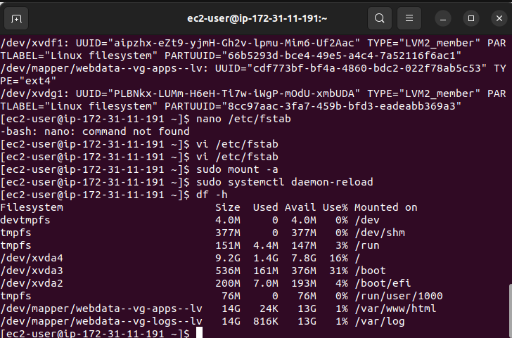

### Installing wordpress and configuring to use MySQL Database

    1.) update the repository and installed Apache and its dependencies
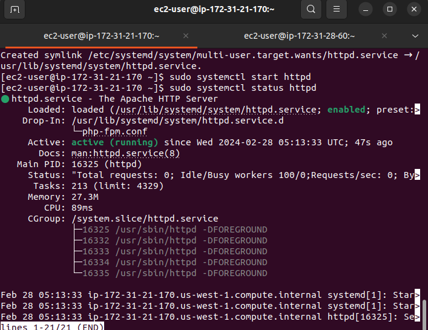

    2.) Install PHP and its dependencies
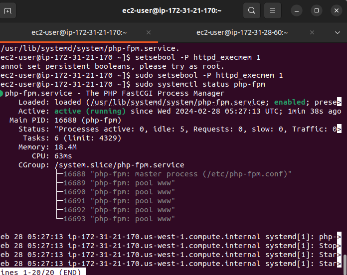
    
    3.) Downloading wordpress and copy 
    wordpress to var/www/html

    Addtionally configure SELinux Polices

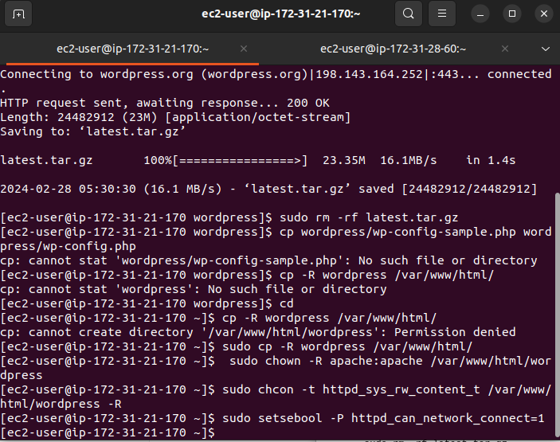
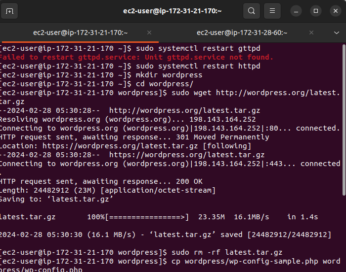

    4.) Install Mysql on my DB server EC2 and configure DB to work with WorPress. 

    Subsequently, configured WordPress to connec to remote database (I have ensured that the DB Server EC2 Inbound rules is listening o port 3306 amd the source is My Webserver's IP address)

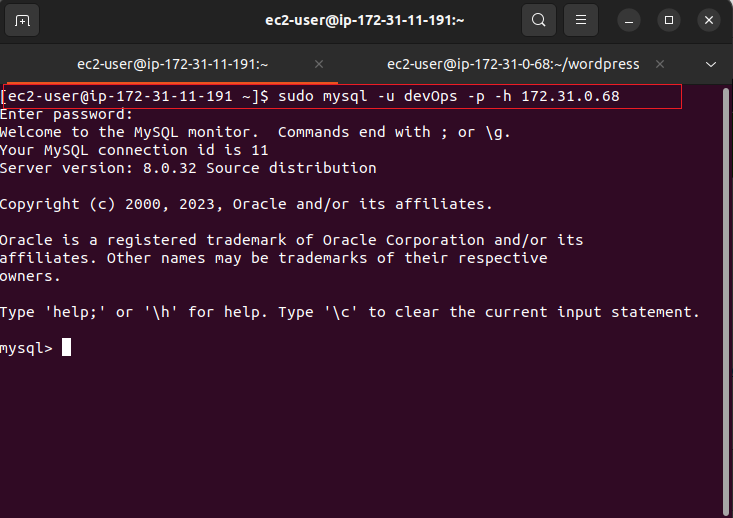
