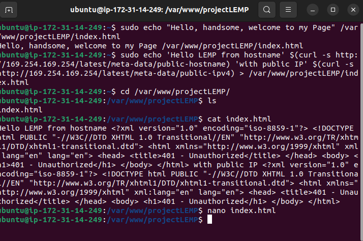
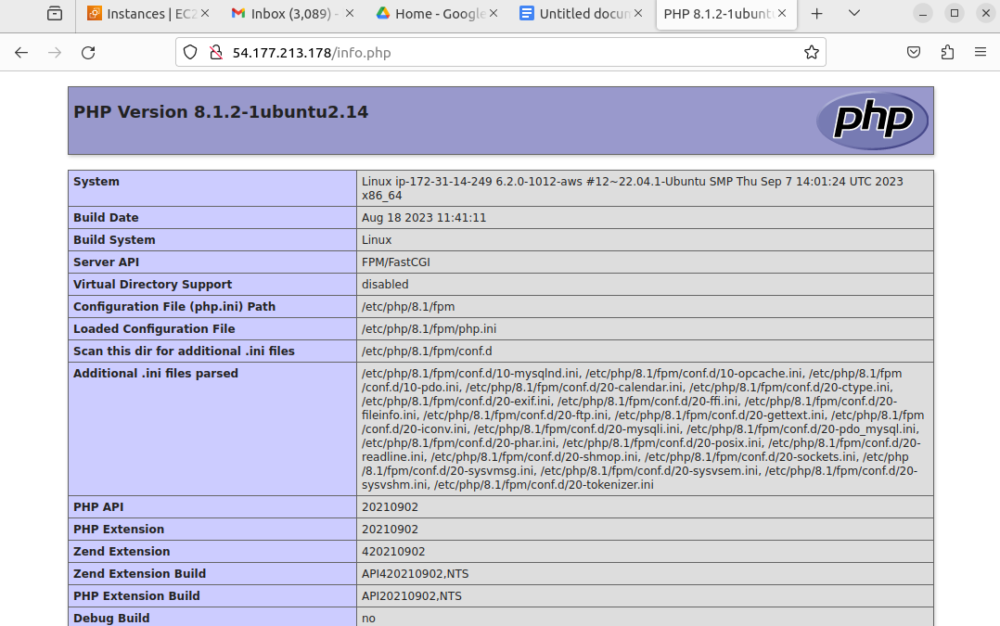

## LEMP Stack Implementation
### Purpose
    To deploy web applications using the LEMP (Linux, Nginx, Mysql, PHP) stack. 
### Goal 
    Through this project I would understand the LEMP Stack components and their dynamic roles in web application development.
*The following are steps I took to implemenent the components LEMP STACK:* 
##
1. To begin, we must set up our environment; AWS Account and a virtual server w/ ubuntu Server OS.  
  a.Created a virtual server using the the my AWS account  
  
  b. connecting using my ssh (TCP port 20) (secure traffic) to my virtual server from my local host. 
  .png>)
  .png>)
  ##
2. Once we have set up our server now we can install our webserver, Nginx. Application that enables web content to be available when requested by a user/client.        
 Using the command 'sudo apt install Nginx' (It is good practice to update the packages embedded in your server's index : 'Sudo apt update'). After installing we can check it status by using the the command seen below
 [Alt text](<img_ref/nginx install.png>)ommand 'sudo systemctl status nginx'
 
As you can see above that nginx web server is enabled 
##
3. As off right now, we can only access the webserver through port 22 , SSH and we want to access the the virtual server via internet browser we have to create an inbound port rule in the AWS EC2 instance that was created above. The port for http (website) is port 80
 
 Now we can access our default web server via internet browser. 
 To check locally, you can use the curl command (ect curl localhost or curl ipaddress)
 
 Or go to the AWS console and copy the ip address and paste it in the web browser

##
4. Now that the webserver (Nginx) is up and ruuning as shown above, I will install my database management system (DBMS).. which will allow me to manage and store data for my site. I will be installing Mysql ... using 'sudo apt install mysql-server'

We need to secure our database system therefore it is best practice to run the pre-installed security script from mysql ... 
Using 'sudo mysql_secure_installation'
##
5. Now for the last implementation; so far we have enabled our webcontent via Nginx and installed our database system to manage and store data and now we will install PHP to process code and generate dynamic content for the web server      
'sudo apt install php-fpm php-mysql'
## 6. Configuring Nginx to Use PHP Processor                       
    a. Create a domain ... for our case : projectLEMP       
    b. Assign the ownership of the directory with the USER environment, which will reference my current system user ($ sudo chown -R $USER:$USER /var/www/projectLEMP)
    c. Create a new configuration file in Nginx's sites-available directory for your domain 'projectLEMP'       
    ##/etc/nginx/sites-available/projectLEMP        
    *The configuration file is as follows :*    
    *#/etc/nginx/sites-available/projectLEMP
##      

    server {    
    listen 80;  
    server_name projectLEMP www.projectLEMP;    
    root /var/www/projectLEMP; 

    index index.html index.htm index.php;

    location / {
        try_files $uri $uri/ =404;
      }

    location ~ \.php$ {
        include snippets/fastcgi-php.conf;
        fastcgi_pass unix:/var/run/php/php8.1-fpm.sock;
       }

    location ~ /\.ht {
        deny all;
       }       
    
    }
##
## 7. Activate the configuration file       
    By linking the the config file from Nginx's sites enabled directory ($ sudo ln -s /etc/nginx/sites-available/projectLEMP /etc/nginx/sites-enabled/)

Next we have to unlink the default web page of nginx 
('sudo unlink /etc/nginx/sites-enabled/default')Then created an index.html file in my domain directory as this will be the the new landing page  

##
## 8. Tesing PHP w/ Nginx      
    The LEMP stack components are successfully installed and running as shown above. Now I am going to test if nginx can correctly handle php files. it just to create a php text file in the domain directory ( sudo nano /var/www/projectLEMP/info.php)   
    **<?php       
    phpinfo();**

##
## 9. Retrieving data from MySQL database w/ PHP
    If you try to enter mysql even with the sudo command you will get denied access. I remembered we set a security check via pre-install security script. Therefore to access mysql you have to put in the command sudo mysql -p       
    Once  you enter your password, I created a new databas,     
     a. mysql> Create Database `sample-track`       
     b. Created a new user and providing the user with its own password - mysql>  CREATE USER 'sample_user'@'%' IDENTIFIED WITH mysql_native_password BY 'PassWord.2';  
     c. Grant access/permission to the user over the database       
     d. created a table called todo_list in my `sample-track` database      
     CREATE TABLE example_database.todo_list (item_id INT AUTO_INCREMENT,content VARCHAR(255),PRIMARY KEY(item_id));      
     e.inserting items in the rows of the table 

## 10. Display/link table to browser 
    a. Create a new php text file in your domain
     $ nano /var/www/projectLEMP/todo_list.php
     The script below will enable the table as page of its own called my ip-address/todo_list.php.      
     To ensure you can access this 'todo_list.php' page ensure the users and password are correct and ensure that in your mysql cosole you have given the user access.
    <?php
    $user = "sample_user";
    $password = "PassWord.2";
    $database = "sample-tracker";
    $table = "todo_list";

    try {
     $db = new PDO("mysql:host=localhost;dbname=$database", $user, $password);
    echo "<h2>TODO</h2><ol>";
    foreach($db->query("SELECT content FROM $table") as $row) {
    echo "<li>" . $row['content'] . "</li>";
     }
     echo "</ol>";
    } catch (PDOException $e) {
    print "Error!: " . $e->getMessage() . " ";
    die();
   }

I initially got access denied but I realized inmy todo_list.php file the password and database name value was written wrong

       