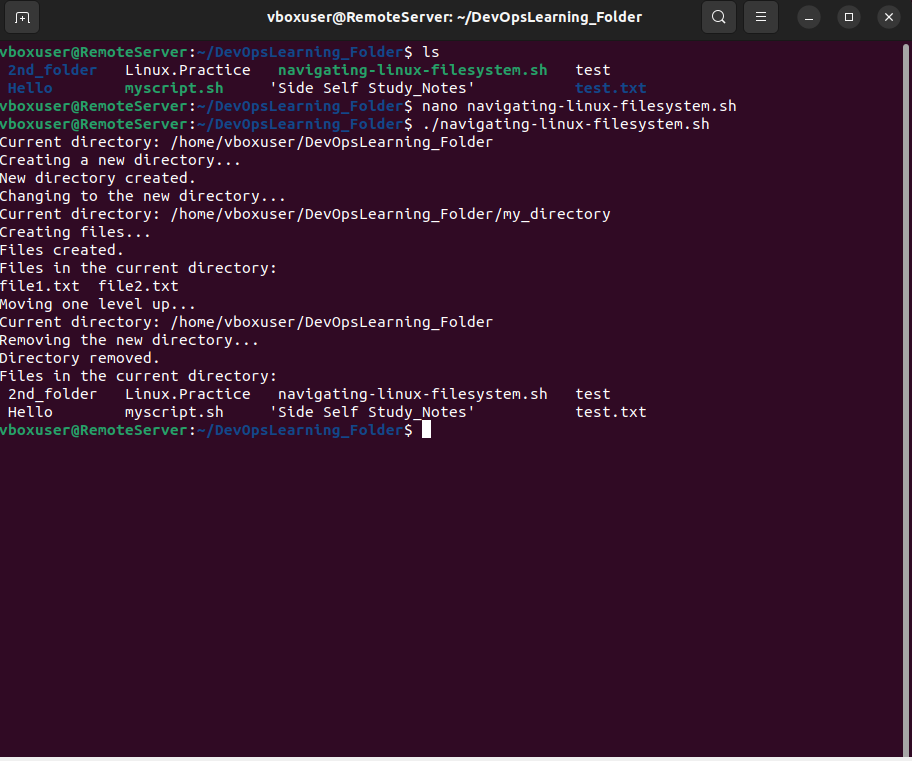

## Shell Scripting  
is used to automate reopetitive commands w/o having to do it
them manually each time and especially if you have several servers running to run simple commands or you want to iterate several files. 
## Starter 
    1. understand that the script file has an '.sh' as the file extention:(i.e ' myscript.sh') --> 
    2. make the file executeable: (i.e 'chmod +x mysccript') 
    3. when in the script file: a declaration of the direlect we are using is bash
    4. we will use the command 'which' to find the location of the bash in the shell.       command 'which bash' 
    5. (#! bash location)
    6. To run you script in the terminal, './myscript'
## Shell Scripting Syntax Elements
### 1. VARIABLES
     UPPERCASE by convention
     Letters, numbers, undescores
     EXAMPLE: Name1="Matthew"
        echo "My name is $Name1" 
        OR 
        echo "My name is ${Name1}"      

### 2. Control Flow
    Statesmentts like if-else, for loops, while loops and case statements to control the flow of execution in the scripts
#### If /elif /else statements
    Example script to check if a number is positive, negative, or zero
    read -p "Enter a number: " num
    if [ $num -gt 0 ]; then
    echo "The number is positive."
    elif [ $num -lt 0 ]; then
    echo "The number is negative."
    else
    echo "The number is zero."
    fi

#### For loops statement - used for interation 

### 3. Directory Manipulation and Navigation
     my steps are shown below
     (refer to the  *navigating-linux-filesysystem.sh* script file for more context):

### 4. File Operations and Sorting
     my steps are shown below 
     (refer to the *sorting.sh* script file for more context):

### 5. Working w/ Numbers & Calculation
     my steps are shown below 
     (refer to the *calculate.sh* script file for more context):

### 6. File Backup and Timestamping
     my steps are shown below 
     (refer to the *backup.sh* script file for more context):

