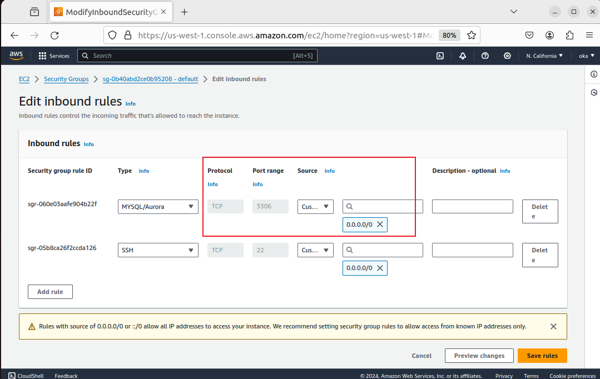
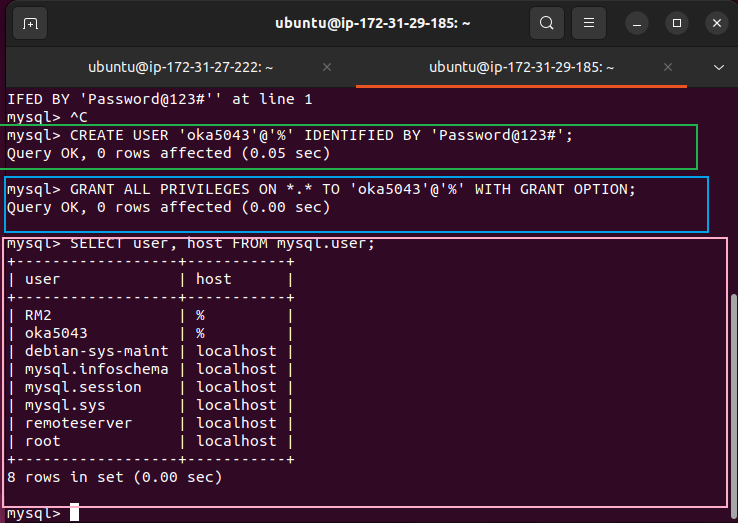
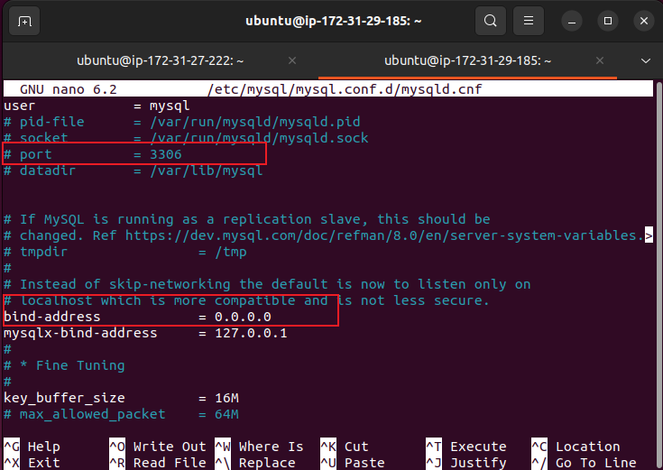
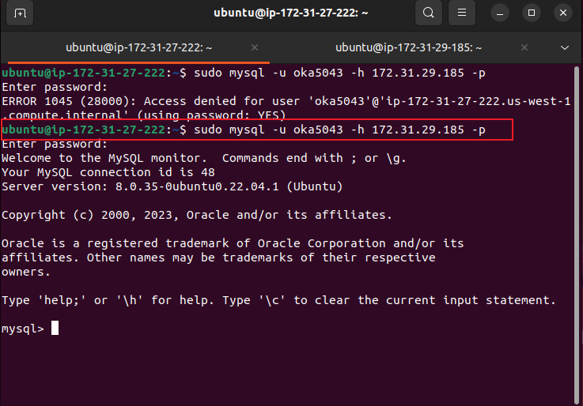
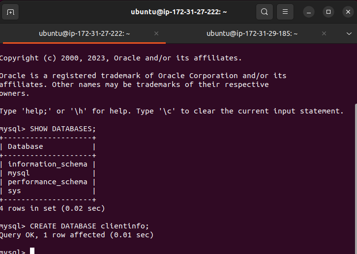

## Understanding CLient Server Arhictecrure w/ MySQL as RDBMS
    The goal is to understand how two or more computers can be connected together over a network to send and receive traffic between each other.

### To acheive the following I did the following: 
    1. Created and configured two linux based virtual servers(EC2 instances in AWS)
    Server A name -mysql server'
    Server B name - 'mysql client'

    2. Since the two virtual server are in the the same local virtual network, they can communicate to each other. But to be able to connect to the server from client the CIDR blocked used is 0.0.0.0/0 listenting on port 3306 

    4. Install MYSQL in each server and confingure mysql and run the pre-install security script: sudo mysql_secure_installation

 

    5. Create a User in mysql Server to be able to connect to from the client to the remote mysql server.
    
    6. In this case we created a user in the DB(mysql) Server call 'oka5043'. In the DB the syntax to create the user for remote connection from anywhere (in our case from client). The sign '%' is important as it allows you to connect from anythere not only from the subnet 'hostname'.
    
    mysql> CREATE USER 'Oka5043'@'% IDENTIFIED BY 'Password@123#';

    In doing this as well grant that User (oka5043) a privilegs or all the privileges as shown above
    
    mysql> GRANT ALL PRIVILEGES ON *.* 'root-user'@'hostname' WITH GRANT OPTION;

    7. After creating the user, we have to ensure the remote DB server's configuration file can grant access for connection from client.

    sudo nano /etc/mysql/mysql.conf.d/mysqld.cnf
     
    8. To do this, ensure in the configuration file the bind address is 0.0.0.0. Which means we can connect from anywhere.

    9. Restart the DB server and go to the client server to connect to the DB server using the user and password we created above

The above image shows that I have deplyed a functional MySQL CLient to Server set up.

