# Introduction to Load Balancing & Nginx
### Purpose
    Discovering and understanding load balanciing with NGINX by learning how to distrubute traffic efficiently across multiple servers, optimize performance, and ensure high availability for my web applications. 
### Goal 
    NGINX is a verstaile software as it can like a webserver, reverse proxy, and load balancet. by learning how to distrubute traffic efficiently across multiple servers, optimize performance, and ensure high availability for my web applications. 

**Steps taken to complete this project is shown below**

### Setting up a Basic Load Balancer
    1. Create two EC2 (virtual servers) instance running ubuntu 22.04. In my case, they will will be called 'webserver1' & 'webserver2'
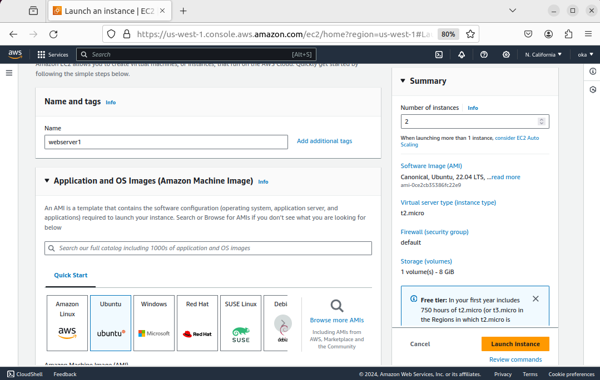

    2. Installing Apache webserver in them and opening port 8000 to allow tracffic from anywhere (0.0.0.0/0). Connection to my EC2 instance was done through an SSH connection
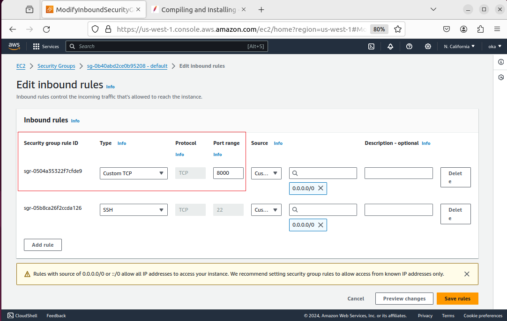

    3. Create another EC2 server that is running on ubuntu and will have Nginx installed and configured to act as a load balacner distributing traffic across the webservers it will run on port 80

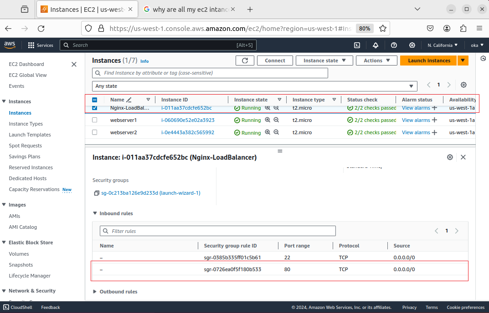

    4. We need to configure our Apache server to listen to port 8000 instead of the default port 80 by going to the configuration (specifically port.config) directory.

    sudo nano /etc/apache2/ports.conf 

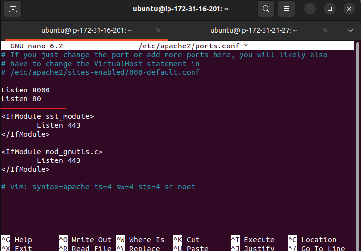

    5. We also need to change the sites-available default port of 80 on virtualhost to port 8000

    sudo nano /etc/apache2/sites-available/000-default.conf

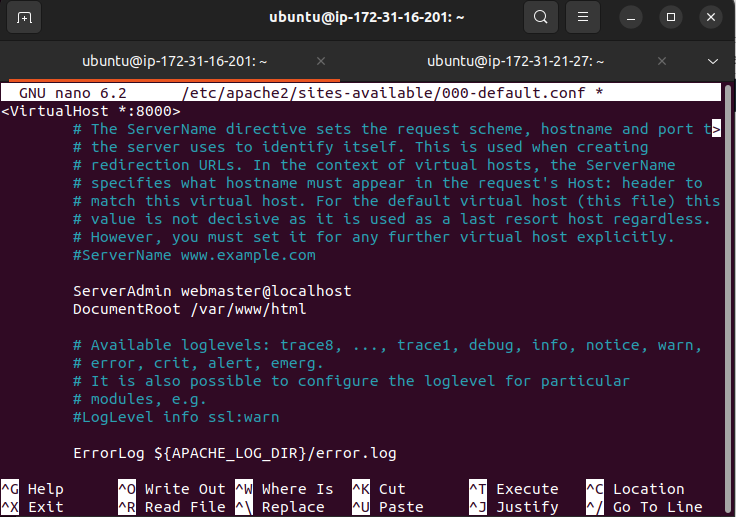

    5. Created and index.html file in the following directory (/var/www/html) which will display the public IP of the EC2 isnstance.

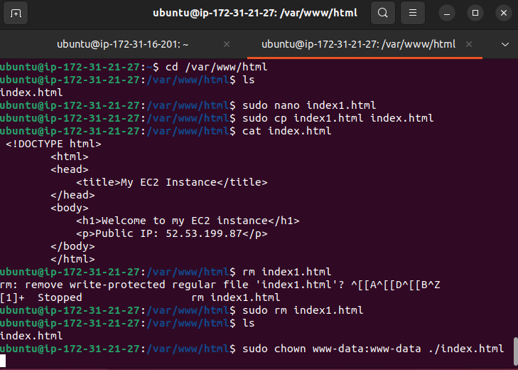
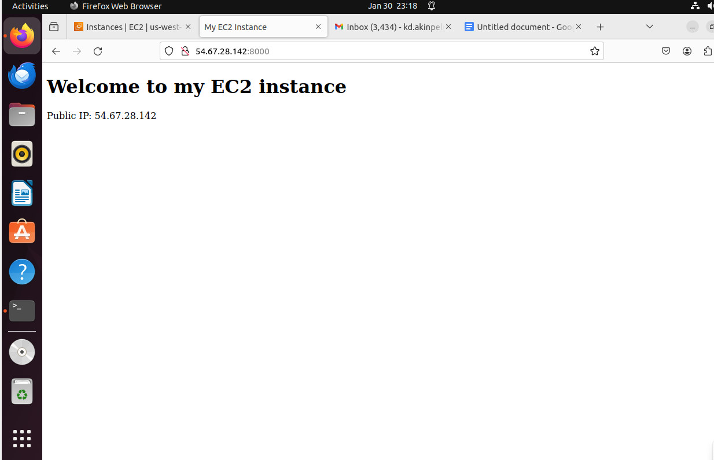
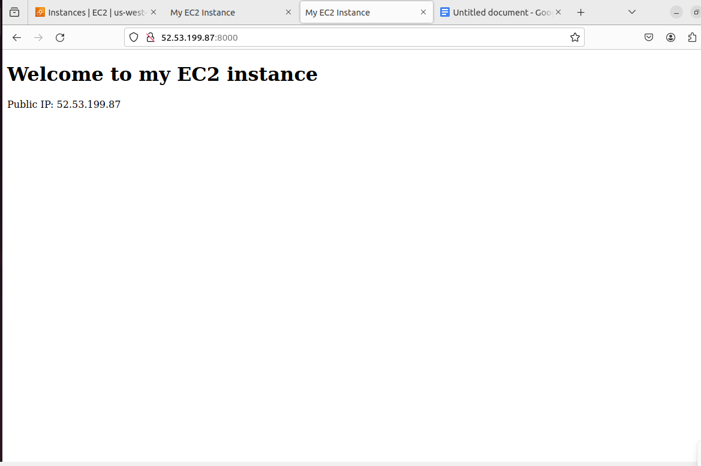

    6. Configure my Nginx EC2 instance as load balancer by opening the configuration file 
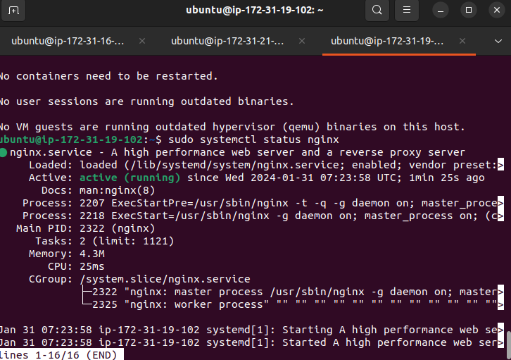

    sudo nano /etc/nginx/conf.d/l   loadbalancer.conf

    using the following code to acheive the configuration file:
            
        upstream backend_servers {

            # your are to replace the public IP and Port to that of your webservers
            server 127.0.0.1:8000; # public IP and port for webserver 1
            server 127.0.0.1:8000; # public IP and port for webserver 2

        }

        server {
            listen 80;
            server_name <your load balancer's public IP addres>; # provide your load balancers public IP address

            location / {
                proxy_pass http://backend_servers;
                proxy_set_header Host $host;
                proxy_set_header X-Real-IP $remote_addr;
                proxy_set_header X-Forwarded-For $proxy_add_x_forwarded_for;
            }
        }
    
    7. Ensure the above file is also in the site-available configuration directory.
    
    Have it replace the default file to ensure that when you access the page it doesn't take you to the default landing page
     sudo nano /etc/nginx/sites-available/default 

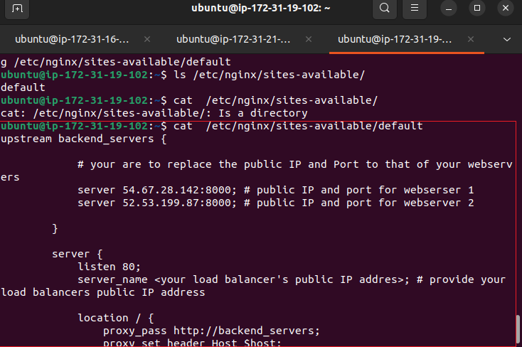

Lastly to test our nginx load balancer, I will copy and paste my virtual instance public IP address in the browser and It will provide me with two different webserver serving me content. 
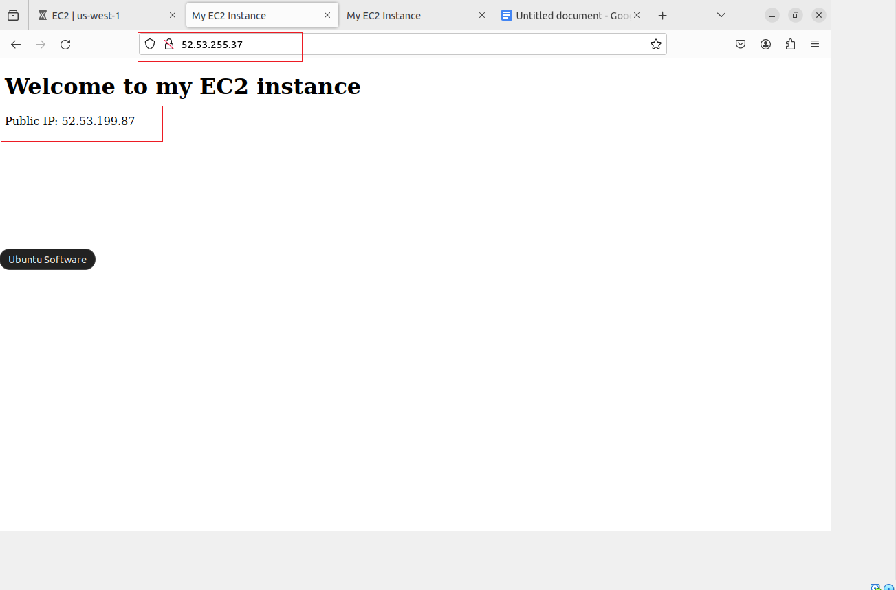

RELOADED THE WEBBROWSER AND YOU SEE THE SAME IP ADDRESS BUT A DIFFERENT CONTENT (thats webserver2)
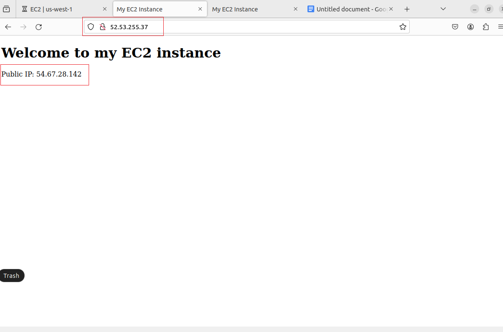
