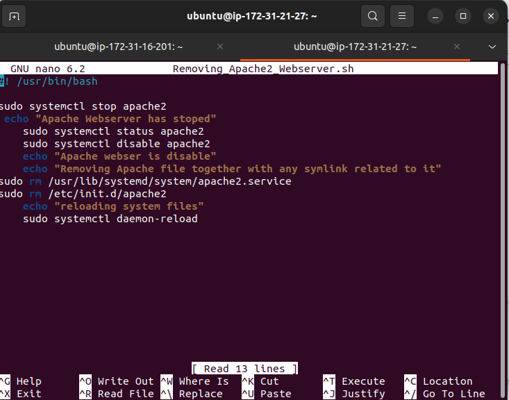
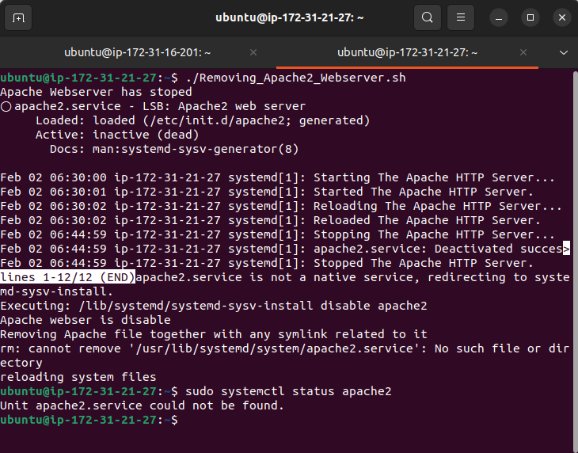
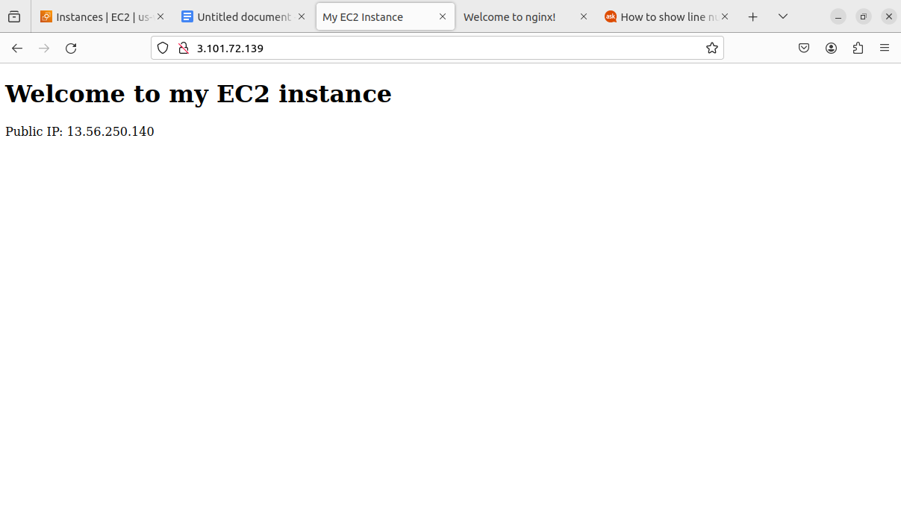

# Automating Loadbalancer configuration with Shell Scripting
### Purpose
    We have used nginx as our loadbalancer but now we want to streamline the process rather than doing all the manual efforts. We will be using shell scripting to streamline the effort.
### Goal 
    This project demonstrates how to automate the setup and maintenance of our loadbalancer using a freestyle job, enchancing efficiency and of course reducing manual effort

#### Using the same webserver 1 and webserver 2 and the EC2 instance configured as my loadbalancer (nginx), I will remove the install and configured webservers in the EC2 instance
    #! bin/
    sudo systemctl stop apache2
    echo "Apache Webserver has stoped"
    sudo systemctl status apache2
    sudo systemctl disable apache2
    echo "Apache webserver is disable"
    echo " Removing Apache file together with any symlink related to i
    sudo rm /usr/lib/systemd/system/apache2.service
    echo "reloading system files"
    sudo systemctl daemon-reload

#### 1. Deploying and configuring our backend webservers by automation
    The shell script for the above is the follow:

    #!/bin/bash

    #This automates the installation and #configuring of apache webserver to #listen on port 8000
    
    #Usage: Call the script and pass in the #Public_IP of your EC2 instance as the #first argument as shown below:
    #./install_configure_apache.sh 127.0.0.1

    set -x # debug mode
    set -e # exit the script if there is an error
    set -o pipefail # exit the script when there is a pipe failure

    PUBLIC_IP=$1

    [ -z "${PUBLIC_IP}" ] && echo "Please pass the public IP of your EC2 instance as an argument to the script" && exit 1

    sudo apt update -y &&  sudo apt install apache2 -y

    sudo systemctl status apache2

    if [[ $? -eq 0 ]]; then
    sudo chmod 777 /etc/apache2/ports.conf
    echo "Listen 8000" >> /etc/apache2/ports.conf
    sudo chmod 777 -R /etc/apache2/

    sudo sed -i 's/<VirtualHost \*:80>/<VirtualHost *:8000>/' /etc/apache2/sites-available/000-default.conf

    fi
    sudo chmod 777 -R /var/www/
    echo "<!DOCTYPE html>
        <html>
        <head>
            <title>My EC2 Instance</title>
        </head>
        <body>
            <h1>Welcome to my EC2 instance</h1>
            
Public IP: "${PUBLIC_IP}"

        </body>
        </html>" > /var/www/html/index.html

    sudo systemctl restart apache2

   #### 2. Deploying and configuring our Nginx Load balancer
    The Shell script is as follows: 
    
    #!/bin/bash

    ######################################################################################################################
    ##### This automates the configuration of Nginx to act as a load balancer
    ##### Usage: The script is called with 3 command line arguments. The public IP of the EC2 instance where Nginx is installed
    ##### the webserver urls for which the load balancer distributes traffic. An example of how to call the script is shown below:
    ##### ./configure_nginx_loadbalancer.sh PUBLIC_IP Webserver-1 Webserver-2
    #####  ./configure_nginx_loadbalancer.sh 127.0.0.1 192.2.4.6:8000  192.32.5.8:8000
    ############################################################################################################# 

    PUBLIC_IP=$1
    firstWebserver=$2
    secondWebserver=$3

    [ -z "${PUBLIC_IP}" ] && echo "Please pass the Public IP of your EC2 instance as the argument to the script" && exit 1

    [ -z "${firstWebserver}" ] && echo "Please pass the Public IP together with its port number in this format: 127.0.0.1:8000 as the second argument to the script" && exit 1

    [ -z "${secondWebserver}" ] && echo "Please pass the Public IP together with its port number in this format: 127.0.0.1:8000 as the third argument to the script" && exit 1

    set -x # debug mode
    set -e # exit the script if there is an error
    set -o pipefail # exit the script when there is a pipe failure

    sudo apt update -y && sudo apt install nginx -y
    sudo systemctl status nginx

    if [[ $? -eq 0 ]]; then
        sudo touch /etc/nginx/conf.d/loadbalancer.conf

        sudo chmod 777 /etc/nginx/conf.d/loadbalancer.conf
        sudo chmod 777 -R /etc/nginx/

        
        echo " upstream backend_servers {

                # your are to replace the public IP and Port to that of your webservers
                server  "${firstWebserver}"; # public IP and port for webserser 1
                server "${secondWebserver}"; # public IP and port for webserver 2

                }

            server {
                listen 80;
                server_name "${PUBLIC_IP}";

                location / {
                    proxy_pass http://backend_servers;   
                }
        } " > /etc/nginx/conf.d/loadbalancer.conf
    fi

    sudo nginx -t

    sudo systemctl restart nginx

#### 3. Verifying the Setup

